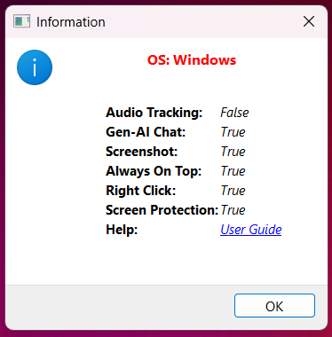
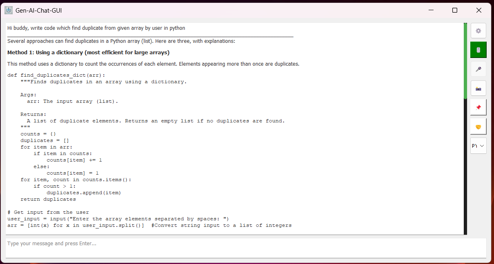
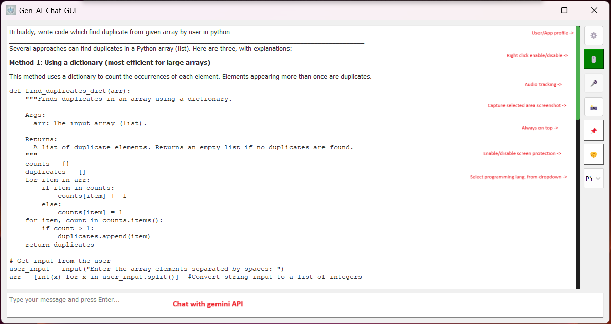
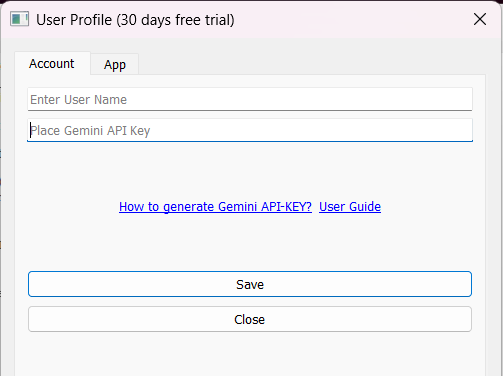
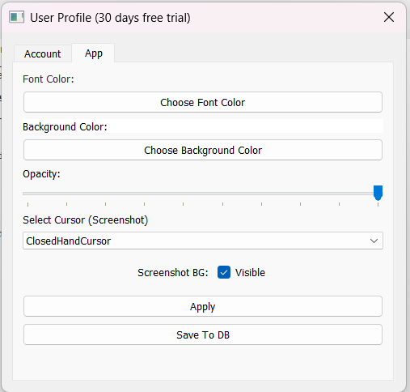
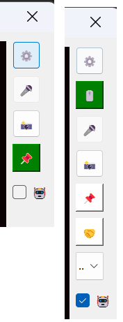

# Gen-AI-Chat-GUI

🚀 <i><u>Note:</u> The original source code for this project is stored in a <u>private repository</u>.  This repository only contains the <u>executable (.exe) file</u> for users to download and use.</i>

Gen-AI-Chat-GUI is a powerful and intuitive desktop application designed to enhance productivity with AI-powered features. It offers seamless AI interaction, audio tracking, screenshot capture, and customizable settings to tailor the experience to your needs.

## Features

- **User Settings:** Modify font color, background color, window opacity, and cursor styles.
- **AI Chat:** Engage in intelligent conversations with an AI assistant.
- **Right-Click Control:** Enable or disable right-click functionality (OS-dependent).
- **Audio Tracking:** Record and process audio efficiently (feature availability depends on the OS).
- **Screenshot Capture:** Quickly take and annotate screenshots.
- **Always On Top:** Keep the app visible above other windows for easy access.
- **Screen Protection:** Safeguard your screen content (OS-dependent).
- **Language Support:** Select from multiple programming languages.

## Set Up (Must Follow)

-  **Clone Repo:**
    ```sh
   git clone https://github.com/LinUxTo5re/Incognito-AI.git
   cd Incognito-AI
   ```
-  **Download .exe Release:** [Download Latest Release](https://github.com/LinUxTo5re/Incognito-AI/releases/)
-  Move .exe file into Incognito-AI and Execute Incognito-AI.exe
## Usage Guide

### **User Settings (⚙️)**
Access settings by clicking the ⚙️ (gear icon):

- **Account Settings:**
  - Enter your username in the text field labeled **"Enter User Name"**.
  - Add your Gemini API key under **"Place Gemini API Key"**.
  - For help generating an API key, visit: [Gemini API Key Documentation](https://ai.google.dev/gemini-api/docs/api-key).
  - Click **Save** to store your account details in AWS for future reference.
  - Click **Close** to exit the user profile, or use the (X) button.

- **App Preferences:**
  - Adjust font color, background color, and opacity.
  - Select a cursor type for screenshots.
  - Toggle screenshot background visibility. Keep it **unchecked** for more security.
  - Apply changes immediately or save them to the database.

---
### **AI Chat**
Engage in intelligent conversations with the AI assistant:

- Type your message in **"Type your message and press Enter..."**.
- Press **Enter** to send the message to Gemini API and receive a response.
- **Note:** You **cannot** paste images or screenshots into the chat.
- **Text Limit:** Messages can be up to **250 words**.

### **Right-Click Control (🖱️)**
By default, this feature hides the **Copy** and **Select All** options in the chat box when right-clicking.

- Even when enabled, you can still copy text manually.
- If **enabled**, the right-click menu will hide the **Copy** and **Select All** options.
---
### **Audio Tracking (🎤)**
- Records audio using the system's built-in audio driver.
- Converts speech to text using the **VOSK model**.
- Supports audio-to-text conversion **up to 250 words**.
---
### **Screenshot Capture (📸)**
Capture a specific area of the screen:

- Click and **drag** to select the area to capture.
- The selected area is **sent to Gemini API** for processing.
- In **App Settings**, you can configure:
  - **Cursor type** for screenshots (default: **ArrowCursor**).
  - **Screenshot background visibility** (default: **transparent without a border**).
---
### **Always On Top (📌)**
- Keeps the application window on top of other windows.
- Click to toggle **Always on Top** functionality.
---
### **Screen Protection (🤝)**
A **privacy-enhancing** feature that keeps your app hidden from screen-sharing applications.

- **Enabled by default:** The app remains **invisible** to third-party websites and screen-sharing tools.
- If **disabled**, the app becomes **visible** to participants in a screen-sharing session.
- **Indicator:**
  - **Gray Button:** Hidden from participants.
  - **White Button:** Visible to participants.
---
### **Language Support**
This dropdown allows you to specify a programming language for **chat and screenshots**.

- The AI will prioritize responses in the selected language.
- You can change the language anytime during a session.
- You can also specify a language manually in your message instead of selecting it from the dropdown.
---
### **Cheat Mode (🤖)**
This allows you to smoothly change between cheat mode and normal mode by hiding/unhiding buttons

- ON - Magic happens
- OFF - Normal mode 
---
## **Trial Mode (15 Days) vs. Pro Mode**

| Feature | Trial Mode | Pro Mode | Dev |
|---------|:---------:|:--------:|:--------:|
| **AI Chat** | ✅ | ✅ | Completed |
| **Right-Click Control (🖱️)** | ❌ | ✅ | Completed |
| **Audio Tracking (🎤)** | ❌ | ✅ |  In Progress | 
| **Screenshot Capture (📸)** | ❌ | ✅ | Completed |
| **Always On Top (📌)** | ✅ | ✅ |  Completed |
| **Screen Protection (🤝)** | ✅ | ✅ | Completed |
| **Language Support** | ✅ | ✅ | Completed |
| **Cheat Mode (🤖)** | ✅ | ✅ | Completed |

---
---

## **Screenshot**
- Info Window - Show avialibility of features os specific 



- Main Window - UI with all mentioned features





- User profile - Set up user name and gemini api key



- App Profile - Set up font color, bg color, opacity, cursor type and screenshot background



- Cheat Mode - Smoothly hide/unhide buttons



## Pricing (excluding 15 days free trial)

| Price (INR) | Price (USD) | Period | Discount/Free |
|---------|:---------:|:--------:|:--------:|
| ₹49 | $0.58 | Daily | - |
| ₹399 | $4.71 | Monthly | 20% on 3 months purchase |
| ₹2400 | $28.37 | 6 Months | Extra 1 month |
| ₹4800 | $56.74 | Yearly | Extra 2 months |

## Contact

For any queries, updates, suggestions, new feature requests, or Pro Mode activation, reach out at:

**Email:** `dev.LinUxTo5re@proton.me`
